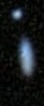
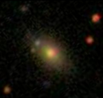
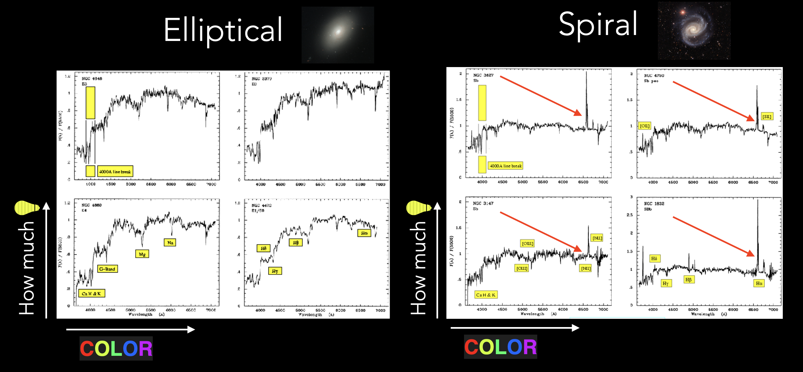

# Classification of Galaxies

Classification of galaxies according to their visual appearance (morphological classification) is an important problem in astrophysics. Shape and features of a galaxy can tell us a lot about its history and the dynamic processes occurring within it. 

This project is about how the optical spectra of galaxies can be used to determine their morphological class. Despite the existence of billions of galaxies, most can be categorized into a few major classes. These classes are illustrated below:

There are two major classes: spiral (S) and elliptical (E), that can be splitted into a few smaller subclasses. Note, that there are other galactic types that are not shown in this picture. In particular, irregular galaxies that don't have a nice and smooth shape and merger galaxies consisting of two or more colliding galaxies that form a huge irregular cluster.  

A common way to classify the galaxies into these subclasses is to use ML models trained on images, that are labeled by volunteers. This has been sucessfully done in the [Galaxy Zoo](https://data.galaxyzoo.org) project. The volunteers visually classified multiple subclasses of galaxies, including irregular and merger types. 

While this is a very common approach to classification, there are some problems. Sometimes images are ambigious and blurred. Here are some examples: 

  
  

The second example is most probably an elliptical galaxy, but it is very hard to distinguish any details of that, as the image is blurry. 

Therefore, the ML models based on images would  sometimes struggle to correctly classify such galaxies - as they cannot outsmart our eyes. In that case we may try to rely on some other data that may contain information related to the type of galaxy. In this project we use optical spectral data of galaxies to classify them. 

> [!NOTE]
> A spectrum contains information about the amount of light that a galaxy emits, as a function of its wavelength (or basically a color). 

Compare the the spectra of a **elliptical** and **spiral** galaxies: 

We see that their shapes and peaks look different. This is because there are different physical processes that are going on in these galaxies. So we may try to use this information to distinguish between different classes. As a starting point we will try to distinguish between larger classes, such as elliptical and spiral. In our labeled data a galaxy was put to one of these categories if 80% or more voters agreed on one of the classes. Otherwise a galaxy was put into "uncertain" category. While this threshold is somewhat arbitrary, increasing it would significantly reduce the usable data, given that more than half of the samples are already classified as 'uncertain'. 

> [!NOTE]
> The spectra of galaxies we observe are influenced not only by the internal physical processes within these galaxies but also by their relative velocities with respect to Earth.  Because of this motion the spectra are basically stretched (this is why more distant astronomical objects look red - because of the Universe expansion they move away from us very fast). To accurately compare these spectra, we must adjust for this shift by multiplying each wavelength by a constant factor, denoted as 
$z$. Without this correction, direct comparison of spectral data would be misleading.

 
## Data used
* Spectral data is from [SDSS - IV](https://www.sdss.org) (Sloan Digital Sky Survey). The data is hosted by the [Flatiron Institute](https://users.flatironinstitute.org/~polymathic/data/MultimodalUniverse/v1/sdss/sdss/).
* Morphological data (labeled) is from [Galaxy Zoo Project, Table 2](https://data.galaxyzoo.org) that focused on labeling images of galaxies. 

## Tools and methods used 

The classification is performed with the Random Forest algorithm. Libraries used: scikit-learn, pandas, numpy, matplotlib, h5py and the astrophysics library healpy. 

## Project files

* **`sdss_healpix.txt`** This file contains the indices of healpixels (segments of the sky) that were scanned by SDSS.
* **`spectral_data_merge.py`** Preparing list of healpixels to download, merging data from the two datasets, to create labels for the spectral data. Saving the data for each healpix to a separate file. 
* **`download_raw_data.py`** A simple script that allows to download only the data we need, as the SDSS database contains information about more galaxies than we have the labels for.
* **`set_slices.py`** Extracting the data that we created for each healpix, and put some slices of this data to a single file (as we might not need all the data we have). In addition, we add a new column, that accounts for the redshift factor $z$.  This column is obtained by multiplying the array of wavelengths by the $z$ factor, unique for each galaxy.  
* **`flatten_data.py`**  Here we further prepare the data for analysis: we perform smoothing (as our data is noisy), we also apply a cutoff mask to our data, so that each data sample contains the same number of features, that correspond to approximately the same set of wavelengths. We assume that small variations of the wavelength value (due to telescope settings mistmatch and precision errors) do not affect the results, as the most important features such as peaks are well-separated. 
* **`training.py`** Here we perform the training and extract the performance data of our model and estimate importance of the features.

## Results

Here we show results for a Random Forest classifier with 1000 trees and maximal depth 20. For data smoothing we used moving average with a window size 5. Higher values resulted in worse results, probably because the distinctive features were smoothed out too much for larger windows. Number of features used: 2400. 
### Elliptical vs. Spiral
Number of samples 9304

| Class | Precision | Recall | F1-Score |
| --- | --- |--- |--- |
| Spiral | 0.91 | 0.85|0.88|
| Elliptical | 0.86 |0.91|0.88|

**Accuracy** 0.88

### Elliptical vs. Uncertain
Number of samples 9304

| Class | Precision | Recall | F1-Score |
| --- | --- |--- |--- |
| Uncertain | 0.80 | 0.71|0.75|
| Elliptical | 0.74 |0.82|0.78|

**Accuracy** 0.77

### Spiral vs. Uncertain
Number of samples 28488

| Class | Precision | Recall | F1-Score |
| --- | --- |--- |--- |
| Uncertain | 0.71 | 0.65|0.68|
| Spiral | 0.68 |0.74|0.71|

**Accuracy** 0.69

## Discussion

Our model successfully differentiates between spiral and elliptical galaxy classes. However, it is less effective at distinguishing between the uncertain class and the  elliptical/spiral classes. This is most probably due to a fact that the uncertain class contains some mislabeled elliptical and spiral samples. We may try to apply some clusterisation methods to the uncertain class and sort out the elliptical/spiral subclasses. 
We may also use the latest version of the data from the Galaxy Zoo project, that contains more detailed information about elliptical and spiral galaxies, and try to use the spectra to distinguish other features, such as shape of the galaxy core, or irregular shapes. 

